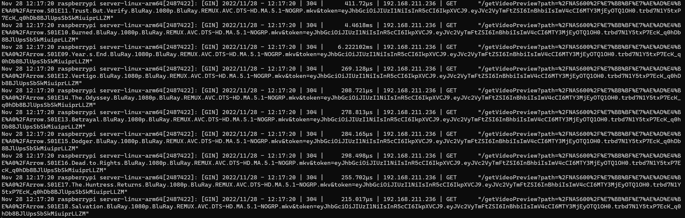

# MediaServerGO
- 🎉Linux、Windows
# api
- `/login`：登录网页
- `/remote_download`：添加下载到本地的Aria2上(localhost:6800)
- `/getAssets`：登录网页的一些js、css资源
- `/userLogin`：用户登录接口
- 🔐`/`：主页
- 🔐`/getDeviceName`：获取服务器设备名，用于网页标题
- 🔐`/getFileList`：获取文件列表
- 🔐`/getCover`：获取剧集封面
- 🔐`/getFile/:name`：在线观看接口，文件路径用URL编码
- 🔐`/getFile2/:name`：在线观看接口，文件路径用URL-Base64编码
- 🔐`/getVideoPreview`：获取视频预览图（5s时的视频截图）
- 🔐`/toggleBookmark`：标记是否已观看
- 🔐`/getDeviceInfo`：获取服务器状态（温度、风扇转速等）
- 🔐`/uploadAss`：转换上传的ass字幕或包含ass的压缩包（支持zip、7z、rar）为srt字幕
- 🔐`/downloadSrt`：下载转换后的srt字幕

# install
- 解压后配置好config.json后运行`server`即可
```json
{
  "port": 80,//监听端口
  "webPath": "F:\\MediaClientWeb",//前端项目路径、见MediaClientWeb项目
  "Aria2": {//Aria2跳板支持，用于迅雷网盘抓包，见XunleiVapture项目
    "RPC": "http://localhost:6800/jsonrpc",//RPC路径
    "Token": ""//token，未测试留空，安全起见建议设置
  },
  "mountPoints": [//磁盘挂载点
    "F:\\media\\NAS500",
    "F:\\media\\NAS600"
  ],
  "JWT": {//用于用户认证
    "algorithm": "HS256",//加密算法
    "secret": "your_key",//密钥
    "durationHours": 168//有效期，7天 == 7 * 24 = 168h
  },
  "users": [//注册用户，目前仅可手动注册
    {
      "name": "pan",//用户名
      "hash": "246DCD487EF18B08F36DEC3AE43029EA"//密码的MD5值
    },{
      "name": "tao",
      "hash": "19A6A0B9360519FE82B5B06B3F79D62C"
    }
  ]
}
```
